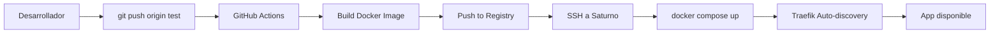

# Guía de Migración: Nginx → Traefik (Ambiente TEST/UAT)

**Servidor:** Saturno (TEST/UAT) | Ubuntu  
**Dominio:** https://enerlovauat.mmlovalledor.cl  
**Fecha:** Diciembre 2024

---

## Índice

1. [Introducción](#1-introducción)
2. [Beneficios de la Migración](#2-beneficios-de-la-migración)
3. [Preparación del Servidor](#3-preparación-del-servidor)
4. [Mapeo de Configuración Nginx → Traefik](#4-mapeo-de-configuración-nginx--traefik)
5. [Configuración de Traefik](#5-configuración-de-traefik)
6. [Docker Compose Completo](#6-docker-compose-completo)
7. [Certificados SSL](#7-certificados-ssl)
8. [Despliegue](#8-despliegue)
9. [Verificación](#9-verificación)
10. [Monitoreo](#10-monitoreo)
11. [Troubleshooting](#11-troubleshooting)

---

## 1. Introducción

Esta guía documenta la migración de **Nginx a Traefik** como reverse proxy en el servidor TEST/UAT (Saturno).

### Contexto

- **Servidor TEST:** Saturno
- **URL:** https://enerlovauat.mmlovalledor.cl
- **Frontend:** Puerto 32010
- **Backend:** Puerto 32011 (ruta `/Enerlova`)
- **Estado actual:** Nginx desinstalado

> [!NOTE]
> **Esta migración aplica SOLO al ambiente TEST.** El servidor de producción mantiene Nginx porque tiene otros sistemas que no pueden modificarse.

### ¿Por qué migrar a Traefik?

| Aspecto | Nginx | Traefik |
|---------|-------|---------|
| **Configuración** | Archivos estáticos, requiere reload | Labels en contenedores, cambios en caliente |
| **Auto-discovery** | Manual | Automático vía Docker API |
| **SSL/TLS** | Requiere configuración manual | Auto-renovación integrada |
| **Dashboard** | Requiere herramientas externas | Incluido nativamente |
| **Métricas** | Requiere exporter adicional | Prometheus nativo |

---

## 2. Beneficios de la Migración

### Operacionales

✅ **Auto-discovery de servicios:** Traefik detecta nuevos contenedores automáticamente  
✅ **Cambios sin downtime:** Modificaciones en labels no requieren reiniciar el proxy  
✅ **Dashboard integrado:** Visualización en tiempo real de rutas y servicios  
✅ **Métricas nativas:** Integración directa con Prometheus/Grafana

### Desarrollo

✅ **Configuración declarativa:** Todo junto al código del servicio  
✅ **Menos archivos:** No más archivos `.conf` separados  
✅ **Debugging simplificado:** Dashboard muestra rutas activas en tiempo real

---

## 3. Preparación del Servidor

### 3.1 Verificar Docker

```bash
# Verificar versión de Docker
docker --version
# Debe ser Docker 20.10+ o superior

# Verificar Docker Compose
docker compose version
# Debe ser v2.x
```

### 3.2 Crear Red Proxy

Traefik requiere una red Docker externa para comunicarse con los servicios.

```bash
# Crear red proxy (si no existe)
docker network create proxy

# Verificar
docker network ls | grep proxy
```

### 3.3 Estructura de Directorios

```bash
# Crear estructura para Traefik
mkdir -p ~/devops/configs/traefik
cd ~/devops/configs/traefik
```

La estructura quedará:

```
~/devops/
├── configs/
│   └── traefik/
│       ├── traefik.yml          # Configuración estática
│       ├── config.yml           # Configuración dinámica
│       ├── acme.json            # Certificados SSL
│       └── docker-compose.yml   # Traefik standalone
└── apps/
    └── enerlova-test/
        └── docker-compose.yml   # App con labels de Traefik
```

---

## 4. Mapeo de Configuración Nginx → Traefik

Esta sección mapea las directivas críticas de `nginx.conf` y `nginx.dev.conf` a la configuración equivalente en Traefik.

### 4.1 Headers de Seguridad

**Nginx (`nginx.conf`):**

```nginx
add_header Content-Security-Policy "default-src 'self'; ...";
add_header Strict-Transport-Security "max-age=31536000; includeSubDomains";
add_header X-Content-Type-Options "nosniff" always;
add_header X-Frame-Options "DENY" always;
add_header X-XSS-Protection "1; mode=block" always;
add_header Referrer-Policy "strict-origin-when-cross-origin" always;
add_header Permissions-Policy "geolocation=(), microphone=(), camera=()" always;
```

**Traefik (Middleware):**

```yaml
# En traefik-config.yml
http:
  middlewares:
    security-headers:
      headers:
        contentSecurityPolicy: "default-src 'self'; script-src 'self' 'unsafe-inline' 'unsafe-eval'; style-src 'self' 'unsafe-inline'; img-src 'self' data: https:; font-src 'self' data:; connect-src 'self' https://*; frame-ancestors 'none';"
        stsSeconds: 31536000
        stsIncludeSubdomains: true
        stsPreload: true
        contentTypeNosniff: true
        frameDeny: true
        browserXssFilter: true
        referrerPolicy: "strict-origin-when-cross-origin"
        permissionsPolicy: "geolocation=(), microphone=(), camera=()"
```

### 4.2 Compresión Gzip

**Nginx:**

```nginx
gzip on;
gzip_types text/plain text/css application/json application/javascript text/xml;
```

**Traefik:**

```yaml
# En traefik-config.yml
http:
  middlewares:
    compression:
      compress: {}
```

### 4.3 Proxy Pass

**Nginx:**

```nginx
# Frontend
location / {
    proxy_pass http://127.0.0.1:32010;
    proxy_set_header Host $host;
}

# Backend
location /Enerlova {
    proxy_pass http://127.0.0.1:32011/Enerlova;
    proxy_set_header Host $host;
}
```

**Traefik (Labels en docker-compose):**

```yaml
# Frontend
labels:
  - "traefik.enable=true"
  - "traefik.http.routers.frontend-test.rule=Host(`enerlovauat.mmlovalledor.cl`)"
  - "traefik.http.services.frontend-test.loadbalancer.server.port=80"

# Backend
labels:
  - "traefik.enable=true"
  - "traefik.http.routers.backend-test.rule=Host(`enerlovauat.mmlovalledor.cl`) && PathPrefix(`/Enerlova`)"
  - "traefik.http.services.backend-test.loadbalancer.server.port=8081"
```

### 4.4 Caché de Assets

**Nginx:**

```nginx
location /assets/ {
    expires 1y;
    add_header Cache-Control "public, no-transform";
}
```

**Traefik:**

Los headers de caché se configuran directamente en la aplicación React (Vite) o mediante middleware de Traefik si es necesario.

### 4.5 Redirección HTTP → HTTPS

**Nginx:**

```nginx
server {
    listen 80;
    return 301 https://$server_name$request_uri;
}
```

**Traefik:**

```yaml
# En traefik.yml
entryPoints:
  web:
    address: ":80"
    http:
      redirections:
        entryPoint:
          to: websecure
          scheme: https
  websecure:
    address: ":443"
```

---

## 5. Configuración de Traefik

### 5.1 Crear traefik.yml

Configuración estática de Traefik.

```bash
cd ~/devops/configs/traefik
nano traefik.yml
```

```yaml
# traefik.yml - Configuración estática para TEST/UAT

api:
  dashboard: true
  insecure: true  # Solo para TEST, permite acceso sin autenticación

entryPoints:
  web:
    address: ':80'
    http:
      redirections:
        entryPoint:
          to: websecure
          scheme: https
  websecure:
    address: ':443'
    http:
      tls:
        options: default

providers:
  docker:
    endpoint: 'unix:///var/run/docker.sock'
    exposedByDefault: false
    network: proxy
  file:
    filename: /config.yml
    watch: true

log:
  level: DEBUG  # Nivel detallado para TEST

accessLog:
  filePath: "/var/log/traefik/access.log"
  format: json

metrics:
  prometheus:
    addEntryPointsLabels: true
    addServicesLabels: true
    addRoutersLabels: true
```

Guardar: `Ctrl+O`, Enter, `Ctrl+X`

### 5.2 Crear config.yml

Configuración dinámica (middlewares, headers, TLS).

```bash
nano config.yml
```

```yaml
# config.yml - Configuración dinámica

http:
  middlewares:
    # Headers de seguridad
    security-headers:
      headers:
        contentSecurityPolicy: "default-src 'self'; script-src 'self' 'unsafe-inline' 'unsafe-eval'; style-src 'self' 'unsafe-inline'; img-src 'self' data: https:; font-src 'self' data:; connect-src 'self' https://*; frame-ancestors 'none';"
        stsSeconds: 31536000
        stsIncludeSubdomains: true
        contentTypeNosniff: true
        frameDeny: true
        browserXssFilter: true
        referrerPolicy: "strict-origin-when-cross-origin"
        permissionsPolicy: "geolocation=(), microphone=(), camera=()"
        customResponseHeaders:
          X-Environment: "TEST-UAT"
    
    # Compresión
    compression:
      compress: {}
    
    # Rate limiting (opcional para TEST)
    rate-limit:
      rateLimit:
        average: 100
        burst: 50

# Opciones de TLS
tls:
  options:
    default:
      minVersion: VersionTLS12
      cipherSuites:
        - TLS_ECDHE_RSA_WITH_AES_128_GCM_SHA256
        - TLS_ECDHE_RSA_WITH_AES_256_GCM_SHA384
        - TLS_ECDHE_RSA_WITH_CHACHA20_POLY1305
```

Guardar: `Ctrl+O`, Enter, `Ctrl+X`

### 5.3 Crear acme.json

Archivo para almacenar certificados SSL.

```bash
touch acme.json
chmod 600 acme.json
```

> [!IMPORTANT]
> El permiso `600` es **obligatorio**. Traefik no iniciará si el archivo tiene permisos incorrectos.

### 5.4 Crear docker-compose.yml para Traefik

```bash
nano docker-compose.yml
```

```yaml
# docker-compose.yml - Traefik standalone para TEST

services:
  traefik:
    image: traefik:v3
    container_name: traefik-test
    restart: unless-stopped
    security_opt:
      - no-new-privileges:true
    environment:
      - DOCKER_API_VERSION=1.44
    networks:
      - proxy
    ports:
      - '80:80'
      - '443:443'
      - '8080:8080'  # Dashboard
    volumes:
      - /etc/localtime:/etc/localtime:ro
      - /var/run/docker.sock:/var/run/docker.sock:ro
      - ./traefik.yml:/traefik.yml:ro
      - ./config.yml:/config.yml:ro
      - ./acme.json:/acme.json
      - traefik_logs:/var/log/traefik
    labels:
      - "traefik.enable=true"
      # Dashboard
      - "traefik.http.routers.traefik-dashboard.rule=Host(`enerlovauat.mmlovalledor.cl`) && (PathPrefix(`/api`) || PathPrefix(`/dashboard`))"
      - "traefik.http.routers.traefik-dashboard.service=api@internal"
      - "traefik.http.routers.traefik-dashboard.entrypoints=websecure"
      - "traefik.http.routers.traefik-dashboard.tls=true"

volumes:
  traefik_logs:

networks:
  proxy:
    external: true
```

Guardar: `Ctrl+O`, Enter, `Ctrl+X`

---

## 6. Docker Compose Completo

Ejemplo de docker-compose para la aplicación Enerlova con labels de Traefik.

### 6.1 Crear directorio de aplicación

```bash
mkdir -p ~/devops/apps/enerlova-test
cd ~/devops/apps/enerlova-test
```

### 6.2 Crear docker-compose.yml

```bash
nano docker-compose.yml
```

```yaml
# docker-compose.yml - Enerlova TEST con Traefik

services:
  frontend:
    image: enerlova-frontend:test
    container_name: enerlova-frontend-test
    restart: unless-stopped
    build:
      context: .
      dockerfile: Dockerfile
      args:
        VITE_API_URL: https://enerlovauat.mmlovalledor.cl/Enerlova
        VITE_APP_ENV: test
    environment:
      - NODE_ENV=production
      - VITE_APP_ENV=test
    networks:
      - proxy
      - enerlova-test
    labels:
      # Habilitar Traefik
      - "traefik.enable=true"
      
      # Router para frontend
      - "traefik.http.routers.enerlova-frontend-test.rule=Host(`enerlovauat.mmlovalledor.cl`)"
      - "traefik.http.routers.enerlova-frontend-test.entrypoints=websecure"
      - "traefik.http.routers.enerlova-frontend-test.tls=true"
      
      # Servicio
      - "traefik.http.services.enerlova-frontend-test.loadbalancer.server.port=80"
      
      # Middlewares
      - "traefik.http.routers.enerlova-frontend-test.middlewares=security-headers@file,compression@file"
    deploy:
      resources:
        limits:
          cpus: '0.5'
          memory: 512M
        reservations:
          cpus: '0.1'
          memory: 128M

  backend:
    image: enerlova-backend:test
    container_name: enerlova-backend-test
    restart: unless-stopped
    build:
      context: ../backend
      dockerfile: Dockerfile
    environment:
      - ASPNETCORE_ENVIRONMENT=Development
      - ConnectionStrings__DefaultConnection=${DB_CONNECTION_STRING}
    networks:
      - proxy
      - enerlova-test
    labels:
      # Habilitar Traefik
      - "traefik.enable=true"
      
      # Router para backend
      - "traefik.http.routers.enerlova-backend-test.rule=Host(`enerlovauat.mmlovalledor.cl`) && PathPrefix(`/Enerlova`)"
      - "traefik.http.routers.enerlova-backend-test.entrypoints=websecure"
      - "traefik.http.routers.enerlova-backend-test.tls=true"
      
      # Servicio
      - "traefik.http.services.enerlova-backend-test.loadbalancer.server.port=8081"
      
      # Middlewares
      - "traefik.http.routers.enerlova-backend-test.middlewares=security-headers@file,compression@file"
    deploy:
      resources:
        limits:
          cpus: '1.0'
          memory: 1G
        reservations:
          cpus: '0.2'
          memory: 256M

networks:
  enerlova-test:
    driver: bridge
  proxy:
    external: true
```

Guardar: `Ctrl+O`, Enter, `Ctrl+X`

---

## 7. Certificados SSL

Para el ambiente TEST, usaremos certificados auto-firmados.

### 7.1 Generar Certificados Auto-firmados

```bash
cd ~/devops/configs/traefik

# Crear directorios
mkdir -p certs

# Generar certificado
sudo openssl req -x509 -nodes -days 365 -newkey rsa:2048 \
  -keyout certs/enerlovauat.key \
  -out certs/enerlovauat.crt \
  -subj "/C=CL/ST=Region/L=Ciudad/O=Empresa/CN=enerlovauat.mmlovalledor.cl"
```

### 7.2 Configurar Certificados en Traefik

Actualizar `config.yml`:

```bash
nano config.yml
```

Agregar al final:

```yaml
# Certificados TLS
tls:
  certificates:
    - certFile: /certs/enerlovauat.crt
      keyFile: /certs/enerlovauat.key
```

### 7.3 Actualizar docker-compose.yml de Traefik

Agregar volumen para certificados:

```yaml
volumes:
  - /etc/localtime:/etc/localtime:ro
  - /var/run/docker.sock:/var/run/docker.sock:ro
  - ./traefik.yml:/traefik.yml:ro
  - ./config.yml:/config.yml:ro
  - ./acme.json:/acme.json
  - ./certs:/certs:ro  # ← AGREGAR ESTA LÍNEA
  - traefik_logs:/var/log/traefik
```

---

## 8. Despliegue

> [!NOTE]
> **Despliegue Automatizado:** El despliegue de Enerlova en TEST se realiza **automáticamente a través de GitHub Actions**, no mediante comandos manuales. Esta sección documenta el proceso automatizado.

### 8.1 Configurar Traefik en Saturno (Una sola vez)

Esta configuración se realiza **una sola vez** en el servidor Saturno para tener Traefik funcionando:

```bash
# Conectar al servidor Saturno
ssh usuario@saturno

# Crear estructura para Traefik
mkdir -p ~/devops/configs/traefik
cd ~/devops/configs/traefik

# Copiar archivos de configuración
# (traefik.yml, config.yml, docker-compose.yml desde el repositorio)

# Crear archivo acme.json
c

# Generar certificados SSL auto-firmados
mkdir -p certs
sudo openssl req -x509 -nodes -days 365 -newkey rsa:2048 \
  -keyout certs/enerlovauat.key \
  -out certs/enerlovauat.crt \
  -subj "/C=CL/ST=Region/L=Ciudad/O=Empresa/CN=enerlovauat.mmlovalledor.cl"

# Iniciar Traefik
docker compose up -d

# Verificar que está funcionando
docker ps | grep traefik-test
docker logs traefik-test
```

### 8.2 Verificar Dashboard de Traefik

Acceder a: `http://IP_SATURNO:8080`

Deberías ver el dashboard de Traefik con:
- ✅ Entrypoints: web (80), websecure (443)
- ✅ Providers: docker, file
- ✅ Middlewares: security-headers, compression

### 8.3 Despliegue de Aplicación vía GitHub Actions

El despliegue de la aplicación Enerlova se realiza **automáticamente** al hacer push a la rama correspondiente:



#### Flujo Automatizado

1. **Desarrollador hace push a rama `test`:**
   ```bash
   git push origin test
   ```

2. **GitHub Actions ejecuta workflow:**
   - ✅ Construye imagen Docker del frontend
   - ✅ Sube imagen al registro<br/>   - ✅ Se conecta vía SSH a Saturno
   - ✅ Ejecuta `docker compose up -d --build` en Saturno
   - ✅ Verifica que los contenedores estén corriendo

3. **Traefik detecta automáticamente** el nuevo contenedor por sus labels y actualiza las rutas

4. **Aplicación disponible** en https://enerlovauat.mmlovalledor.cl

#### Verificar Despliegue en GitHub

1. Ir a tu repositorio en GitHub
2. Click en la pestaña **Actions**
3. Ver el workflow en ejecución o los logs del último despliegue
4. Estado debe ser ✅ verde (exitoso)

### 8.4 Monitorear Despliegue en Saturno

Puedes monitorear el estado del despliegue directamente en Saturno:

```bash
# Ver logs de GitHub Actions runner (si aplica)
# O conectar a Saturno

ssh usuario@saturno

# Ver contenedores corriendo
docker ps

# Ver logs de aplicación
docker logs -f enerlova-frontend-test

# Ver dashboard de Traefik
# Acceder a http://IP_SATURNO:8080
```

### 8.5 Rollback Manual (Si es necesario)

Si algo sale mal con un despliegue, puedes hacer rollback manualmente:

```bash
ssh usuario@saturno
cd ~/ruta/donde/github/actions/despliega

# Ver imágenes disponibles
docker images | grep enerlova-frontend

# Detener contenedor actual
docker stop enerlova-frontend-test

# Iniciar con imagen anterior
docker run -d --name enerlova-frontend-test \
  --network proxy \
  --network enerlova-test \
  --label traefik.enable=true \
  --label "traefik.http.routers.enerlova-frontend-test.rule=Host(\`enerlovauat.mmlovalledor.cl\`)" \
  --label "traefik.http.routers.enerlova-frontend-test.entrypoints=websecure" \
  --label "traefik.http.routers.enerlova-frontend-test.tls=true" \
  --label "traefik.http.services.enerlova-frontend-test.loadbalancer.server.port=80" \
  enerlova-frontend:VERSION_ANTERIOR

# Verificar que Traefik detectó el cambio
curl -s http://localhost:8080/api/http/routers | jq
```

### 8.6 Archivos Necesarios en Repositorio

Para que GitHub Actions funcione correctamente, asegúrate de tener en tu repositorio:

```
📁 .github/
└── workflows/
    └── deploy-test.yml      # Workflow de despliegue TEST

📁 res/
├── docker-compose.test.yml  # Con labels de Traefik
├── Dockerfile               # Build del frontend
├── traefik-test.yml         # Config Traefik (para referencia)
└── traefik-config-test.yml  # Config dinámica (para referencia)
```

El archivo `docker-compose.test.yml` ya debe tener las **labels de Traefik** configuradas como se muestra en la sección 6.

---


## 9. Verificación

### 9.1 Verificar Rutas en Dashboard

1. Abrir dashboard: `http://IP_SERVIDOR:8080`
2. Ir a **HTTP** → **Routers**
3. Verificar que existen:
   - `enerlova-frontend-test`
   - `enerlova-backend-test`
4. Estado debe ser **verde** (activo)

### 9.2 Probar Endpoints

```bash
# Frontend (debe redireccionar a HTTPS)
curl -I http://enerlovauat.mmlovalledor.cl

# Frontend HTTPS
curl -k https://enerlovauat.mmlovalledor.cl

# Backend
curl -k https://enerlovauat.mmlovalledor.cl/Enerlova/health
```

### 9.3 Verificar Headers de Seguridad

```bash
curl -k -I https://enerlovauat.mmlovalledor.cl | grep -E "X-|Content-Security|Strict-Transport"
```

Deberías ver:
- `X-Content-Type-Options: nosniff`
- `X-Frame-Options: DENY`
- `Strict-Transport-Security: max-age=31536000`
- `Content-Security-Policy: ...`
- `X-Environment: TEST-UAT`

### 9.4 Verificar SSL

```bash
openssl s_client -connect enerlovauat.mmlovalledor.cl:443 -servername enerlovauat.mmlovalledor.cl
```

---

## 10. Monitoreo

### 10.1 Dashboard de Traefik

URL: `http://IP_SERVIDOR:8080`

Características:
- **Overview:** Estado general del sistema
- **HTTP Routers:** Todas las rutas configuradas
- **Services:** Servicios backend detectados
- **Middlewares:** Middlewares activos (headers, compression)

### 10.2 Logs

```bash
# Logs de Traefik
docker logs -f traefik-test

# Logs de acceso (JSON)
docker exec traefik-test tail -f /var/log/traefik/access.log | jq
```

### 10.3 Métricas Prometheus

Traefik expone métricas en: `http://IP_SERVIDOR:8080/metrics`

Para integrar con Prometheus, agregar en `prometheus.yml`:

```yaml
scrape_configs:
  - job_name: 'traefik'
    static_configs:
      - targets: ['traefik-test:8080']
```

---

## 11. Troubleshooting

### Problema: Traefik no detecta contenedores

**Síntoma:** Dashboard vacío, no aparecen routers.

**Soluciones:**

1. Verificar que los contenedores tienen `traefik.enable=true`:
   ```bash
   docker inspect enerlova-frontend-test | grep traefik.enable
   ```

2. Verificar que están en la red `proxy`:
   ```bash
   docker network inspect proxy
   ```

3. Reiniciar Traefik:
   ```bash
   docker restart traefik-test
   ```

### Problema: Error de permisos en acme.json

**Síntoma:** `traefik-test` no inicia, logs muestran error de permisos.

**Solución:**

```bash
cd ~/devops/configs/traefik
chmod 600 acme.json
```

### Problema: Certificado SSL no confiable

**Síntoma:** Navegador muestra advertencia de certificado.

**Solución:**

Es **normal** para certificados auto-firmados en TEST. Opciones:

1. **Aceptar el riesgo** en el navegador (opción "Continuar de todos modos")
2. **Agregar certificado a confianzas** del sistema operativo
3. **Usar Let's Encrypt** si tienes dominio público (no recomendado para TEST interno)

### Problema: 404 Not Found

**Síntoma:** Traefik responde 404 para todas las rutas.

**Verificar:**

1. Regla de router correcta:
   ```yaml
   - "traefik.http.routers.NAME.rule=Host(`enerlovauat.mmlovalledor.cl`)"
   ```

2. Puerto del servicio correcto:
   ```yaml
   - "traefik.http.services.NAME.loadbalancer.server.port=80"
   ```

3. Contenedor escuchando en ese puerto:
   ```bash
   docker exec CONTAINER_NAME netstat -tlnp
   ```

### Problema: Backend devuelve 502 Bad Gateway

**Síntoma:** Frontend funciona, pero `/Enerlova` da error 502.

**Verificar:**

1. Backend está corriendo:
   ```bash
   docker ps | grep backend
   docker logs enerlova-backend-test
   ```

2. Puerto correcto en labels:
   ```yaml
   - "traefik.http.services.enerlova-backend-test.loadbalancer.server.port=8081"
   ```

3. Backend está en la red `proxy`:
   ```bash
   docker network inspect proxy | grep backend
   ```

### Comandos Útiles de Debugging

```bash
# Ver todas las rutas activas
curl -s http://localhost:8080/api/http/routers | jq

# Ver todos los servicios
curl -s http://localhost:8080/api/http/services | jq

# Ver middlewares
curl -s http://localhost:8080/api/http/middlewares | jq

# Logs en tiempo real
docker logs -f --tail 100 traefik-test

# Inspeccionar configuración de un contenedor
docker inspect enerlova-frontend-test | jq '.[0].Config.Labels'
```

---

## Comandos de Administración Diaria

```bash
# Reiniciar Traefik
docker restart traefik-test

# Ver estado de todos los servicios
docker ps --format "table {{.Names}}\t{{.Status}}\t{{.Ports}}"

# Actualizar configuración dinámica (sin reiniciar)
nano ~/devops/configs/traefik/config.yml
# Traefik detecta cambios automáticamente en 1-2 segundos

# Ver uso de recursos
docker stats traefik-test enerlova-frontend-test enerlova-backend-test

# Backup de configuración
tar czf ~/traefik-backup-$(date +%Y%m%d).tar.gz ~/devops/configs/traefik/
```

---

## Resumen de la Migración

✅ **Nginx eliminado** - Ya desinstalado en Saturno  
✅ **Traefik instalado** - Con auto-discovery y dashboard  
✅ **Certificados SSL** - Auto-firmados para TEST  
✅ **Headers de seguridad** - Migrados a middlewares  
✅ **Compresión** - Activada vía middleware  
✅ **Monitoreo** - Dashboard y métricas Prometheus

### Ventajas Obtenidas

- ✨ Configuración declarativa junto al código
- ✨ Auto-discovery de nuevos servicios
- ✨ Dashboard en tiempo real
- ✨ Cambios sin reiniciar el proxy
- ✨ Métricas Prometheus nativas

---

**Documento generado:** Diciembre 2024  
**Versión:** 1.0  
**Ambiente:** TEST/UAT (Saturno)
