# Monitor de Lecturas - Diagrama de Arquitectura

Documentación visual de la arquitectura del sistema de monitoreo de lecturas.

## Diagrama de Componentes

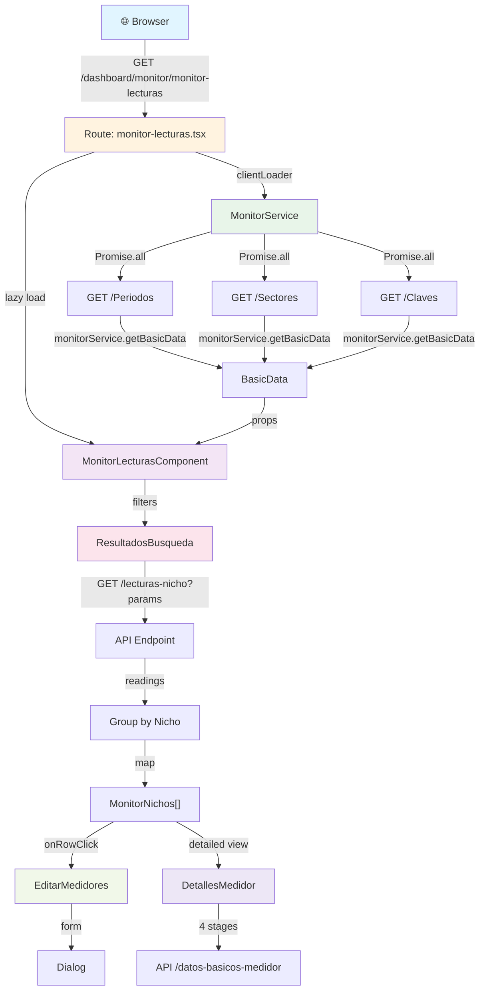

## Flujo de Carga Inicial

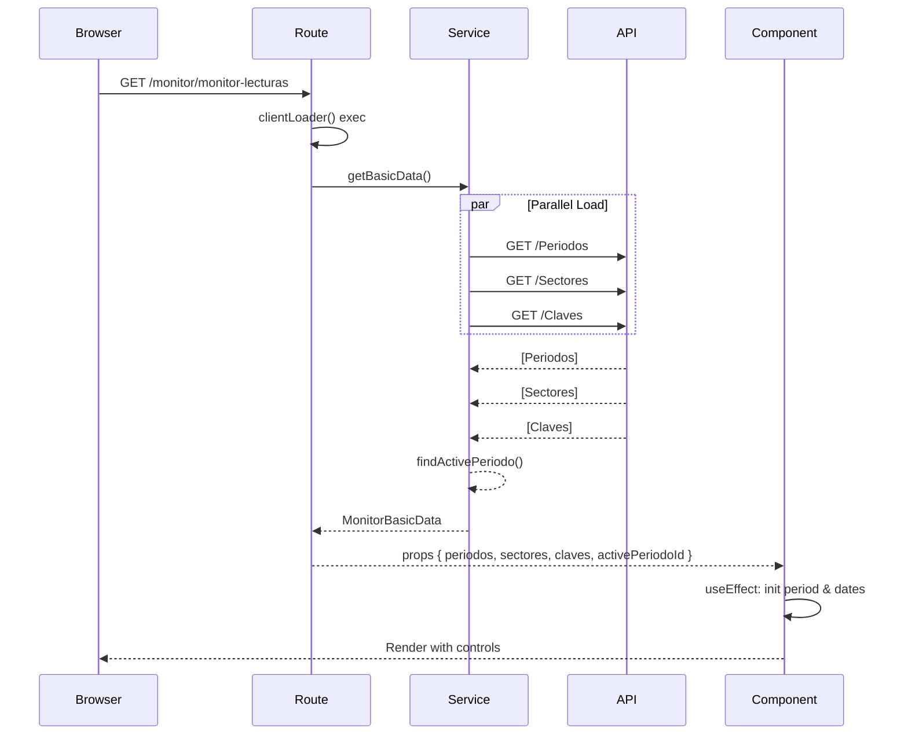

## Flujo de Búsqueda

```mermaid
stateDiagram-v2
    [*] --> Filters

    Filters: User selects:<br/>- Sector (required)<br/>- Period (required)<br/>- Dates (optional)<br/>- Advanced filters (optional)

    Filters --> Validation: Click "Iniciar Monitoreo"

    Validation: validateSearchParams()<br/>Check sector & period

    Validation -->|Invalid| ErrorToast: Show error message
    ErrorToast --> Filters

    Validation -->|Valid| Search: setIsSearchActive(true)

    Search: Fetch /lecturas-nicho<br/>with filters

    Search --> Loading: Show spinner<br/>Calculate stats

    Loading --> Results: Display by nicho<br/>Show statistics

    Results --> MonitorNichos: Virtualized table<br/>per nicho

    MonitorNichos --> EditChoice{User<br/>Action}

    EditChoice -->|Edit row| EditDialog: Open EditarMedidores
    EditChoice -->|View details| DetailsDialog: Open DetallesMedidor
    EditChoice -->|Search in nicho| FilteredTable: Debounced search

    EditDialog --> Submit: Save changes
    Submit --> Refresh: setNeedsRefreshOnClose
    Refresh --> Search

    FilteredTable --> Results

    Results -->|Limpiar| Filters
```

## Arquitectura de Estado

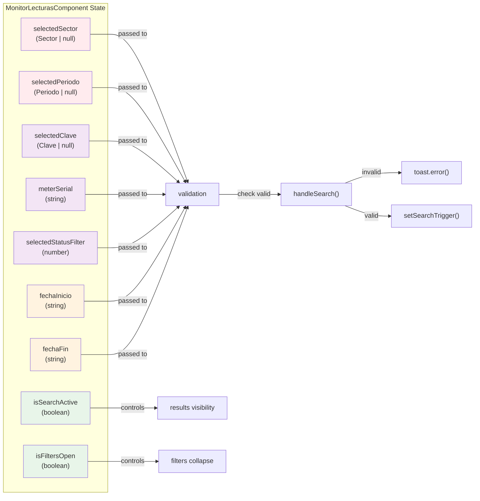

## Ciclo de Vida de Edición de Medidor

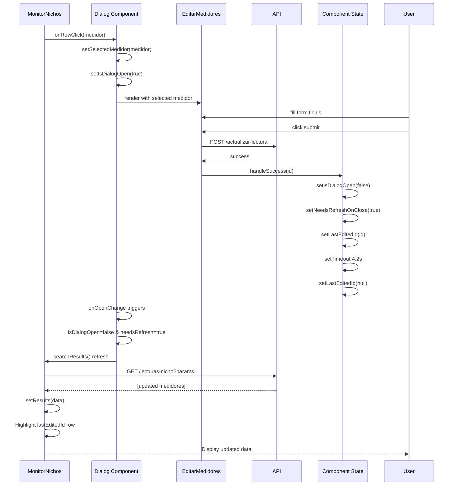

## Estructura de Datos - Flujo de Lectura

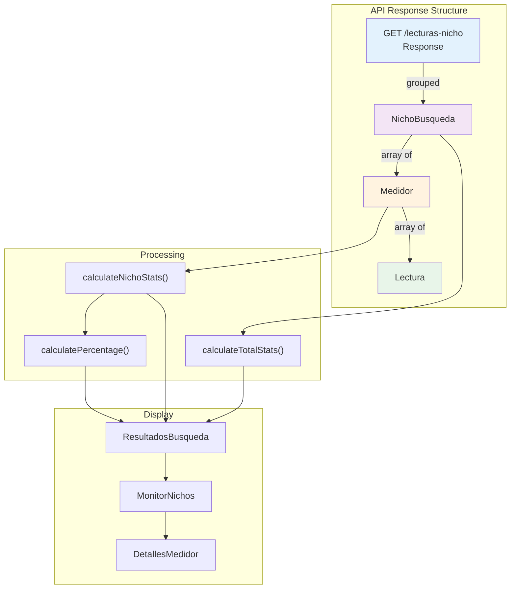

## Validación y Manejo de Errores

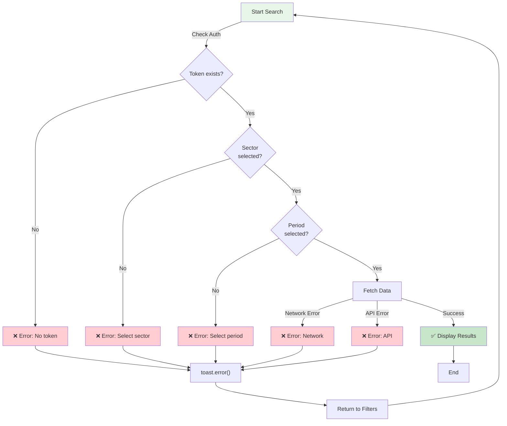

## Virtualización de Tabla

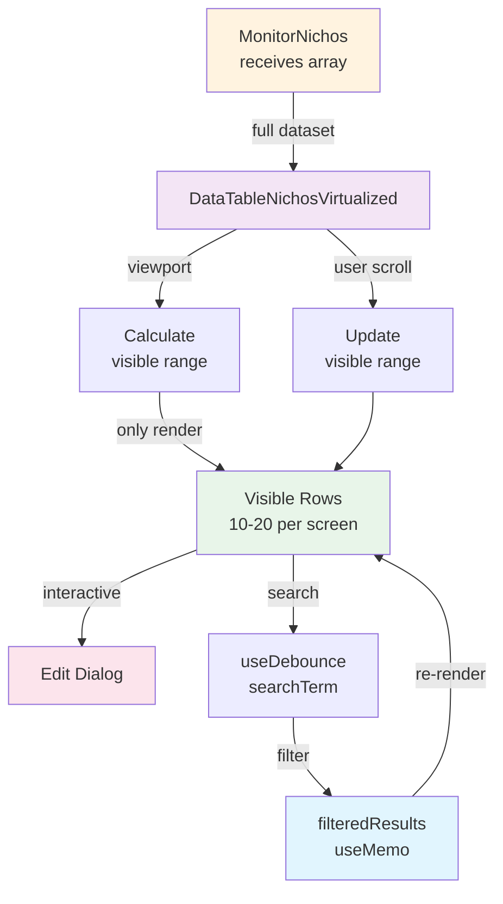

## Búsqueda Debounced en Tabla

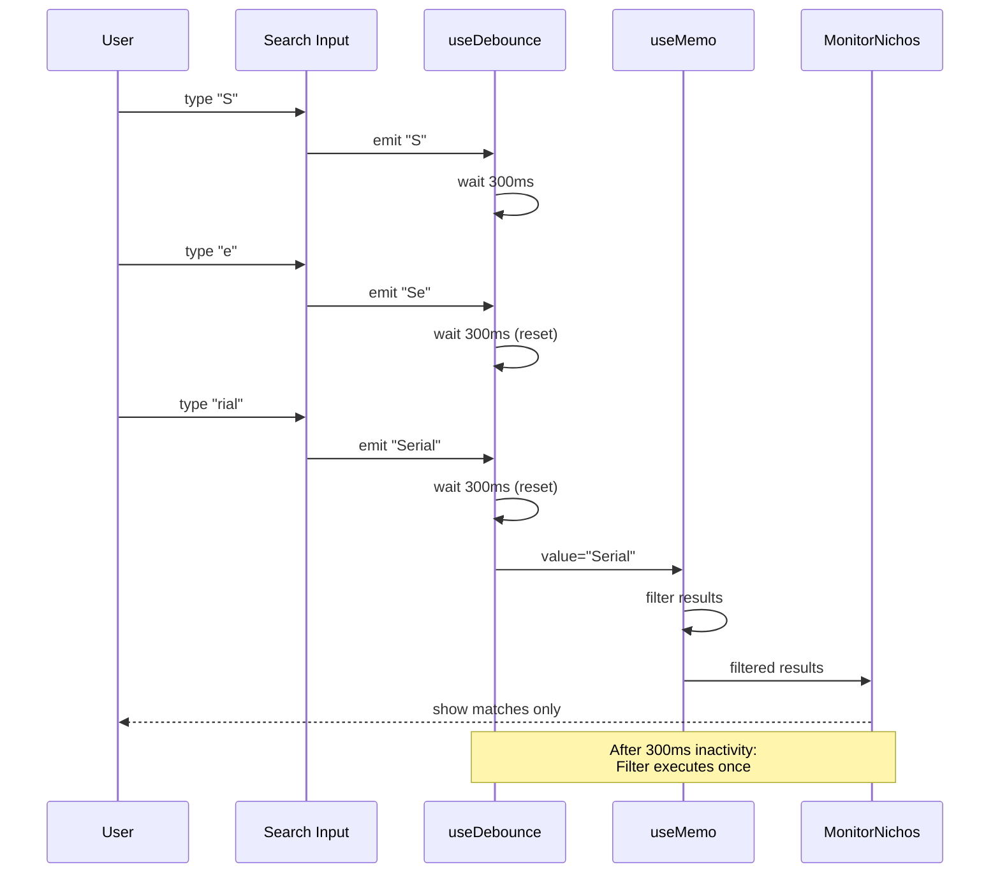

## Estado de Carga de Datos

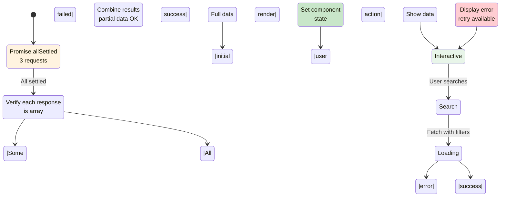

## Integración de Tour Interactivo

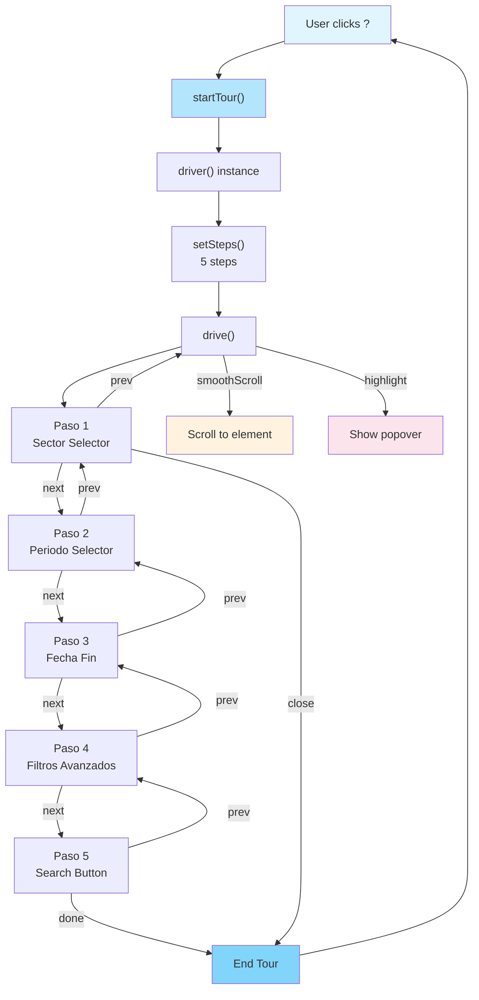

## Componentes Secundarios - Detalles Medidor

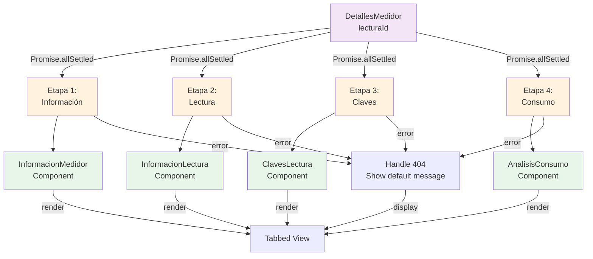

## Keyboard Shortcuts Dispatch

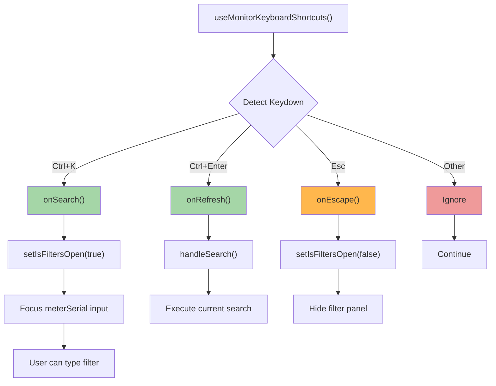

## Request Caching Strategy

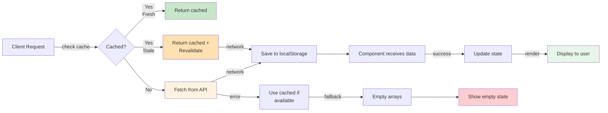

## Performance Optimization Timeline

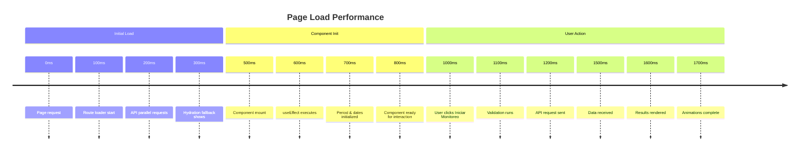

## Data Flow Summary

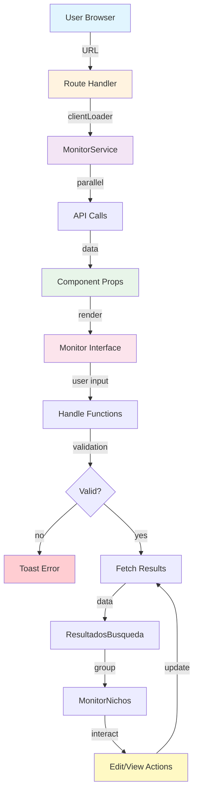

