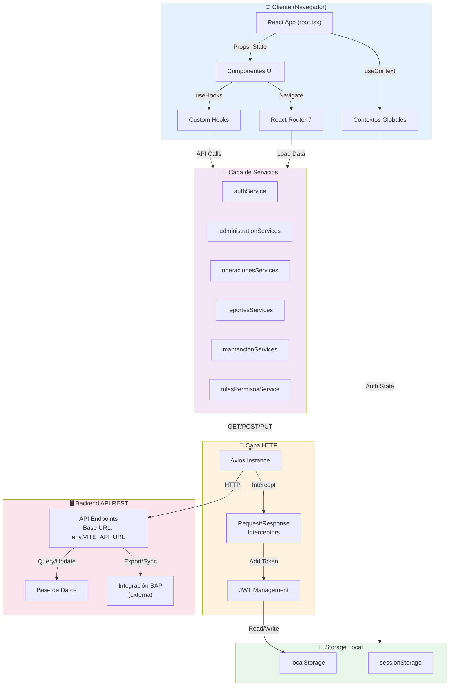

# 🏗️ Pregunta 4: Arquitectura General del Proyecto

**Fecha de análisis**: 4 de Diciembre 2025  
**Versión del análisis**: 1.0  
**Estado**: Análisis completo del código vs. documentación existente

---

## 📌 Resumen Ejecutivo

Se ha realizado un análisis completo de la arquitectura del proyecto **ENERLOVA** (Sistema Integral de Gestión Energética). El proyecto es una aplicación **frontend React/TypeScript** con arquitectura en capas que se comunica con un backend API Rest. La documentación existente es **incompleta y parcial** - solo documentaba el módulo de Monitor, no la arquitectura general.

---

## 🏛️ Arquitectura General Actual

### 1. **Stack Tecnológico Principal**

#### Core Frontend
| Tecnología | Versión | Rol |
|-----------|---------|-----|
| **React** | 19.1.0 | Framework UI principal |
| **React Router** | 7.5.3 | Enrutamiento file-based con SPA |
| **TypeScript** | 5.8.3 | Lenguaje principal con tipado estático |
| **Vite** | 6.3.3 | Build tool y dev server optimizado |
| **Tailwind CSS** | 4.1.4 | Framework CSS utility-first |

#### UI/Componentes
| Tecnología | Versión | Rol |
|-----------|---------|-----|
| **Radix UI** | ~1.x | Componentes base accesibles (sin estilos) |
| **Lucide React** | 0.513.0 | Librería de iconografía |
| **Next Themes** | 0.4.6 | Gestión tema oscuro/claro |
| **Sonner** | - | Toast/notificaciones |

#### Gestión de Datos
| Tecnología | Versión | Rol |
|-----------|---------|-----|
| **Axios** | 1.9.0 | Cliente HTTP con interceptores |
| **React Hook Form** | 7.56.4 | Gestión de formularios |
| **Zod** | 3.25.36 | Validación de esquemas de datos |
| **TanStack Table** | 8.21.3 | Tablas avanzadas con virtualizacion |

#### Librerías de Utilidad
| Tecnología | Versión | Rol |
|-----------|---------|-----|
| **@dnd-kit** | ^6/^9 | Drag & Drop nativo |
| **date-fns** | - | Manipulación de fechas |
| **jwt-decode** | - | Decodificación de JWT |
| **clsx** | - | Utilidad para className condicional |

---

### 2. **Arquitectura en Capas**

```
┌─────────────────────────────────────────────────────────────────┐
│                   PRESENTATION LAYER (UI)                       │
│  ┌──────────────┐ ┌────────────────┐ ┌──────────────┐          │
│  │  Pages/      │ │  Components    │ │   Hooks      │          │
│  │  Routes      │ │  (UI Logic)    │ │   (State)    │          │
│  │ (root.tsx,   │ │ (React comps)  │ │ (Custom)     │          │
│  │  dashboard/) │ │               │ │               │          │
│  └──────────────┘ └────────────────┘ └──────────────┘          │
└─────────────────────────────────────────────────────────────────┘
                            │
                            │ (Props, Context)
                            ▼
┌─────────────────────────────────────────────────────────────────┐
│                   BUSINESS LAYER                                │
│  ┌────────────┐ ┌──────────────┐ ┌──────────────┐             │
│  │  Services  │ │   Context    │ │    Utils     │             │
│  │ (API Call) │ │  (Global     │ │  (Helpers,   │             │
│  │ Logic)     │ │   State)     │ │   formatters) │             │
│  └────────────┘ └──────────────┘ └──────────────┘             │
└─────────────────────────────────────────────────────────────────┘
                            │
                            │ (Axios)
                            ▼
┌─────────────────────────────────────────────────────────────────┐
│                    DATA LAYER                                   │
│  ┌────────────┐ ┌────────────┐ ┌──────────────────┐           │
│  │   Axios    │ │   Types    │ │    Storage       │           │
│  │  Instance  │ │ (TypeScript │ │  (localStorage)  │           │
│  │            │ │  interfaces)│ │                  │           │
│  └────────────┘ └────────────┘ └──────────────────┘           │
└─────────────────────────────────────────────────────────────────┘
                            │
                            │ (HTTP REST)
                            ▼
        ┌────────────────────────────────────┐
        │   BACKEND API REST (No documentado)│
        │ Base URL: env.VITE_API_URL         │
        │ (192.168.1.139:8081/Enerlova)      │
        └────────────────────────────────────┘
```

---

### 3. **Estructura de Carpetas**

```
app/
├── components/                  # Componentes React organizados por módulo
│   ├── administracion/          # CRUD de datos maestros
│   │   ├── acometida/           # Gestión de acometidas
│   │   ├── clientes/            # Gestión de clientes
│   │   ├── contratos/           # Gestión de contratos
│   │   ├── medidores/           # Gestión de medidores
│   │   └── usuarios/            # Gestión de usuarios
│   ├── auth/                    # Componentes de autenticación
│   │   └── login.tsx
│   ├── dashboard/               # Layout principal y dashboard
│   ├── data-table/              # Componentes reutilizables de tabla
│   ├── guards/                  # Protección de rutas
│   ├── mantencion/              # Módulo de mantención
│   │   ├── ciclos-facturacion/
│   │   ├── conceptos/
│   │   ├── parametros/
│   │   ├── tarifas/
│   │   └── zonas/
│   ├── monitor/                 # Módulo de monitoreo de lecturas
│   │   ├── monitor-lecturas/    # Monitor principal
│   │   ├── exportar-lecturas/
│   │   └── importar-lecturas/
│   ├── operaciones/             # Módulo de operaciones y facturación
│   │   ├── anular-factura-impresa/
│   │   ├── cambio-medidor/
│   │   ├── corte-reposicion/
│   │   ├── crear-archivos-sap/
│   │   ├── periodo-facturacion/
│   │   ├── revisar-calculo-factura/
│   │   └── etc...
│   ├── reportes/                # Módulo de reportes
│   │   ├── facturacion/
│   │   ├── resumen/
│   │   └── detalles-contrato/
│   ├── shared/                  # Componentes compartidos
│   ├── sidebar/                 # Navegación lateral
│   ├── skeletons/               # Loaders y skeletons
│   ├── ui/                      # Componentes UI base (Radix UI + Tailwind)
│   └── configuracion/           # Configuración de usuario
│
├── context/                     # Contextos React (global state)
│   ├── AuthContext.tsx          # Estado de autenticación
│   ├── BreadcrumbContext.tsx    # Migas de pan
│   └── LoadingBarContext.tsx    # Barra de carga
│
├── hooks/                       # Custom hooks
│   ├── use-administracion.ts
│   ├── use-claves.ts
│   ├── use-debug-info.ts
│   ├── use-keyboard-shortcuts.ts
│   ├── use-loader.tsx
│   └── (más de 20 hooks)
│
├── lib/
│   ├── api.ts                   # Cliente API wrapper (exports: api, useApiWithLoadingBar)
│   └── utils.ts
│
├── routes/                      # Definición de rutas (file-based)
│   ├── auth/
│   │   ├── login.tsx
│   │   ├── forgot-password.tsx
│   │   └── reset-password.tsx
│   ├── dashboard/
│   │   ├── layout.tsx           # Layout wrapper
│   │   ├── monitor/
│   │   ├── operaciones/
│   │   ├── administracion/
│   │   ├── mantencion/
│   │   ├── reportes/
│   │   └── configuracion/
│   ├── protected-route.tsx      # Wrapper de rutas protegidas
│   ├── session-expired.tsx
│   └── home.tsx
│
├── services/                    # Capa de servicios API
│   ├── core/                    # Base de servicios
│   │   ├── api-response.ts      # Tipado de respuestas
│   │   ├── api-processing.ts    # Procesamiento de datos
│   │   └── base-service.ts      # Clase base para servicios
│   ├── administration/          # Servicios de administración
│   │   ├── index.ts
│   │   ├── clientesService.ts
│   │   ├── contratosService.ts
│   │   ├── medidoresService.ts
│   │   ├── usuariosService.ts
│   │   └── etc...
│   ├── operations/              # Servicios de operaciones
│   ├── reportes/                # Servicios de reportes
│   ├── mantencion/              # Servicios de mantención
│   ├── roles-permisos/          # Servicios de RBAC
│   ├── axiosConfig.ts           # Configuración Axios + interceptores
│   ├── authService.ts           # Autenticación
│   ├── userService.ts           # Gestión de usuario
│   ├── monitorService.ts        # Monitoreo de lecturas
│   └── index.ts                 # Exportaciones centralizadas
│
├── types/                       # Definiciones TypeScript
│   ├── administracion.ts        # Tipos de administración
│   ├── monitor.ts               # Tipos de monitor
│   ├── operaciones.ts           # Tipos de operaciones
│   ├── mantencion.ts
│   ├── reportes.ts
│   └── roles-permisos.ts
│
├── utils/                       # Utilidades
│   ├── performance-monitor.ts   # Monitoreo de performance
│   ├── formatters.ts            # Formateo de datos
│   └── (otros helpers)
│
├── root.tsx                     # Root layout component
├── app.css                      # Estilos globales
├── app.dev.css                  # Estilos desarrollo
└── routes.ts                    # Configuración de rutas
```

---

### 4. **Flujo de Autenticación**

```
┌────────────────────────────────────────┐
│  Usuario ingresa credenciales en       │
│  /auth/login                           │
└────────────────────────────────────────┘
                 │
                 ▼
        ┌─────────────────────┐
        │  authService.login  │
        │  (usuario, pwd)     │
        └─────────────────────┘
                 │
                 ▼
        ┌──────────────────────────┐
        │  POST /login             │
        │  via axiosInstance       │
        └──────────────────────────┘
                 │
                 ▼
        ┌──────────────────────────┐
        │  Backend responde:       │
        │  { token: "jwt..." }     │
        └──────────────────────────┘
                 │
                 ▼
        ┌──────────────────────────┐
        │  localStorage.setItem    │
        │  ('token', token)        │
        │  AuthContext.setUser()   │
        └──────────────────────────┘
                 │
                 ▼
        ┌──────────────────────────┐
        │  jwtDecode(token)        │
        │  Extrae: id, username,   │
        │  role, fullName          │
        └──────────────────────────┘
                 │
                 ▼
        ┌──────────────────────────┐
        │  rolesPermisosService    │
        │  .getPermisosUsuario()   │
        └──────────────────────────┘
                 │
                 ▼
        ┌──────────────────────────┐
        │  AuthContext actualizado │
        │  Redirect a /dashboard   │
        └──────────────────────────┘
```

---

### 5. **Sistema de Interceptores Axios**

El proyecto implementa un sistema robusto de interceptores:

#### **Request Interceptor**
- ✅ Agrega token JWT al header `Authorization: Bearer <token>`
- ✅ Configura headers CORS
- ✅ Timeout de 15 segundos

#### **Response Interceptor**
- ✅ Detecta errores 401 (sesión expirada)
- ✅ Intenta refrescar token automáticamente
- ✅ Redirige a `/session-expired` si falla
- ✅ Diferencia entre errores esperados (negocio) vs. técnicos
- ✅ Maneja rutas donde 401/404 son respuestas normales

#### **Rutas con Errores Esperados**
```typescript
// 401 esperado en estas rutas
- /login
- /refresh-token
- validar-usuario-modificacion
- cambiar-contrasena

// 404 esperado en estas rutas
- /datos-basicos-medidor
- /calculo-prefactura-encabezado
- /calculo-prefactura-cargos
```

---

### 6. **Control de Acceso (RBAC)**

```
┌──────────────────────────────────────┐
│  AuthContext                         │
│  ├── user: UserData                 │
│  ├── permissions: PermisosUsuario[]  │
│  └── métodos:                        │
│      ├── hasPermission(ruta)        │
│      ├── canView(ruta)              │
│      ├── canCreate(ruta)            │
│      ├── canEdit(ruta)              │
│      └── canDelete(ruta)            │
└──────────────────────────────────────┘
         │
         ▼
┌──────────────────────────────────────┐
│  rolesPermisosService                │
│  ├── getRoles()                      │
│  ├── getMenus()                      │
│  ├── getPermisos()                   │
│  ├── getUsuarioRoles()               │
│  └── getPermisosUsuario(userId)      │
└──────────────────────────────────────┘
         │
         ▼
┌──────────────────────────────────────┐
│  Componentes de Guarda (Guards)      │
│  ├── ProtectedRoute                  │
│  ├── RoleGuard                       │
│  └── PermissionGuard                 │
└──────────────────────────────────────┘
```

---

### 7. **Servicios API (Módulos)**

#### **Administración**
```typescript
export {
  clientesService,           // Gestión de clientes
  contratosService,          // Gestión de contratos
  medidoresService,          // Gestión de medidores
  acometidaService,          // Gestión de acometidas
  referenceDataService,      // Datos de referencia
  usuariosService,           // Gestión de usuarios
  propietariosService,       // Gestión de propietarios
  contratantesService        // Gestión de contratantes
}
```

#### **Operaciones**
```typescript
export {
  periodosService,                    // Períodos de facturación
  pricingService,                     // Precios y cargos
  preparationService,                 // Preparación de lecturas
  billingCalculationService           // Cálculo de facturas
}
```

#### **Reportes**
```typescript
export {
  summaryReportService,               // Reportes resumen
  billingReportService,               // Reportes de facturación
  contractDetailsReportService        // Reportes de contratos
}
```

#### **Mantención**
```typescript
export {
  referenceDataMantencionService,     // Datos de referencia
  conceptsService,                    // Conceptos de facturación
  classificationsService,             // Clasificaciones
  nichosService                       // Nichos (sectores)
}
```

#### **Roles y Permisos**
```typescript
export {
  rolesService,                       // Gestión de roles
  menusService,                       // Gestión de menús
  permisosService,                    // Gestión de permisos
  usuarioRolesService                 // Asignación usuario-rol
}
```

---

### 8. **Enrutamiento (React Router v7)**

**Configuración file-based** en `routes.ts`:

```
/
├── /auth
│   ├── /login                    → login.tsx
│   ├── /forgot-password
│   └── /reset-password
├── /dashboard (protected)
│   ├── /                         → dashboard.tsx
│   ├── /monitor
│   │   ├── /monitor-lecturas
│   │   ├── /exportar-lecturas
│   │   └── /importar-lecturas
│   ├── /operaciones
│   │   ├── /periodo-facturacion
│   │   ├── /precios-cargo
│   │   ├── /revisar-precio
│   │   ├── /preparar-lecturas
│   │   ├── /cerrar-lecturas
│   │   └── /revisar-calculo-factura
│   ├── /administracion
│   │   ├── /clientes
│   │   ├── /contratos
│   │   ├── /medidores
│   │   ├── /usuarios
│   │   └── /acometidas
│   ├── /mantencion
│   │   ├── /ciclos-facturacion
│   │   ├── /conceptos
│   │   ├── /parametros
│   │   ├── /tarifas
│   │   └── /zonas
│   ├── /reportes
│   │   ├── /facturacion
│   │   ├── /resumen
│   │   └── /detalles-contrato
│   └── /configuracion
├── /session-expired
└── /* → 404 Not Found
```

---

### 9. **Patrones de Componentes**

#### **Component Pattern**
```typescript
// Feature Component (e.g., MonitorLecturas)
export function MonitorLecturasComponent() {
  // Local state
  // Effects
  // Handlers
  return JSX
}

// Container Pattern
export default MonitorLecturasComponent
```

#### **Data Loading Pattern**
```typescript
// Route loader
export const clientLoader = async () => {
  const data = await monitorService.getBasicData()
  return data
}

// Component
export default function Route({ loaderData }) {
  return <MonitorLecturasComponent data={loaderData} />
}
```

#### **Form Pattern**
```typescript
// useForm from react-hook-form
// Validation with Zod
// Submit handling
```

---

### 10. **Gestión de Estado**

#### **Local State**
- `useState()` para estado local de componentes

#### **Context (Global)**
- `AuthContext` - Usuario, permisos, autenticación
- `BreadcrumbContext` - Navegación
- `LoadingBarContext` - Indicador de carga global

#### **Server State**
- Cacheado en Axios (interceptores)
- Refetch manual via servicios

---

### 11. **Integración Backend**

**API Base URL**: Configurable via `.env`
```
VITE_API_URL=http://192.168.1.139:8081/Enerlova
```

**Endpoints esperados** (inferidos del código):
- `POST /login` - Autenticación
- `POST /refresh-token` - Renovar JWT
- `GET /Periodos` - Períodos de facturación
- `GET /Sectores` - Sectores/Nichos
- `GET /Claves` - Claves/Clasificaciones
- `GET /lecturas-nicho?params` - Lecturas de medidores
- `GET /datos-basicos-medidor` - Detalles del medidor
- `GET /calculo-prefactura-*` - Cálculos de facturación
- Y muchos más endpoints según el tipo de operación

---

### 12. **Configuración de Build**

#### **Vite Configuration**
```typescript
// vite.config.ts features:
- Plugin customizado: envCssPlugin() 
  → Carga app.dev.css en desarrollo
- Code splitting automático:
  * react-vendor (React core)
  * ui-vendor (Radix UI)
- Compresión Gzip + Brotli en producción
- Bundle analyzer (modo 'analyze')
- Tailwind CSS integrado
- TS config paths alias: ~ → ./app/
```

#### **TypeScript Configuration**
```jsonc
{
  "compilerOptions": {
    "target": "ESNext",
    "module": "ESNext",
    "moduleResolution": "bundler",
    "jsx": "react-jsx",
    "strict": true,
    "paths": { "~/*": ["./app/*"] }
  }
}
```

---

## ⚠️ Problemas Identificados en la Arquitectura

### 1. **Documentación Desactualizada**
- ❌ `ARCHITECTURE.md` solo documentaba el módulo Monitor, no la arquitectura general
- ✅ **Este documento actualiza esa brecha**

### 2. **Falta de Diagrama Visual Actualizado**
- ❌ No existe diagrama de arquitectura general en formato visual
- 🔧 **Se incluye en este documento**

### 3. **Dispersión de Servicios**
- ⚠️ Servicios no centralizados en patrón consistente
- Solución: Refactorización reciente con `core/base-service.ts`

### 4. **Management de Estado Global**
- ⚠️ Solo usa Context (no Redux/Zustand)
- Impacto: Puede ser suficiente para proyecto actual
- Riesgo: Prop drilling en aplicaciones muy grandes

### 5. **Integración Backend**
- ❌ Base URL configurada solo via variables de entorno
- ⚠️ No hay documentación de API contracts
- 🔧 Necesario documento de especificación API

---

## 🔐 Consideraciones de Seguridad Identificadas

### 1. **Autenticación**
- ✅ JWT con localStorage (estándar)
- ✅ Token refresh automático
- ⚠️ Token almacenado en localStorage (vulnerable a XSS)
  - Recomendación: Considerar httpOnly cookies

### 2. **Autorización**
- ✅ RBAC implementado en frontend
- ⚠️ Se confía en el RBAC del backend
- 🔐 **Crítico**: Validar RBAC también en backend (nunca solo en frontend)

### 3. **Interceptores Axios**
- ✅ Headers CORS configurados
- ✅ Diferencia entre errores técnicos y de negocio
- ✅ Manejo de sesiones expiradas

### 4. **Validación**
- ✅ Zod valida esquemas en cliente
- ⚠️ **Crítico**: Validación debe repetirse en servidor

### 5. **Gestión de Errores**
- ✅ Toast notifications para errores
- ⚠️ Posibles información sensible en mensajes de error
  - Recomendación: Sanitizar mensajes en producción

---

## 📊 Diagrama General Completo



---

## 📋 Checklist de Documentación vs. Realidad

| Aspecto | Documentado | Realidad | Estado |
|--------|-----------|---------|--------|
| Stack tecnológico | ✅ Parcial | ✅ Completo | ⚠️ Actualizado |
| Arquitectura general | ❌ No | ✅ Existe | 🆕 Documentado aquí |
| Enrutamiento | ✅ Existe | ✅ Coincide | ✅ OK |
| Servicios | ✅ Existe | ✅ Completo | ✅ OK |
| Control de acceso | ✅ Existe | ✅ Implementado | ✅ OK |
| Autenticación | ✅ Existe | ✅ JWT | ✅ OK |
| Gestión de estado | ⚠️ Mínimo | ✅ Context API | ⚠️ Documentar más |
| Manejo de errores | ⚠️ Mínimo | ✅ Robusto | ⚠️ Documentar más |
| Variables de entorno | ✅ Existe | ✅ Existe | ✅ OK |

---

## 🎯 Recomendaciones Basadas en Este Análisis

### Inmediatas (Seguridad)
1. ✅ Validar RBAC también en backend (nunca solo en frontend)
2. ✅ Sanitizar mensajes de error en producción
3. ✅ Considerar httpOnly cookies en lugar de localStorage

### Corto Plazo (Documentación)
1. ✅ Crear especificación OpenAPI/Swagger del backend
2. ✅ Documentar todos los endpoints esperados
3. ✅ Actualizar README con arquitectura completa

### Mediano Plazo (Escalabilidad)
1. ⏳ Considerar estado global (Zustand/Redux) si crece
2. ⏳ Implementar caching layer (React Query/SWR)
3. ⏳ Documentar decisiones de arquitectura (ADR)

---

## 📝 Conclusión

La arquitectura del proyecto **ENERLOVA** es sólida y sigue patrones modernos de React:
- ✅ Separación clara de capas (Presentation → Business → Data)
- ✅ Modularización por dominio
- ✅ Control de acceso basado en roles (RBAC)
- ✅ Gestión segura de tokens JWT
- ✅ Integración robusta con API backend

**La documentación anterior era incompleta** (solo cubría el módulo Monitor), pero el **código está bien estructurado**. Este documento sirve como **punto de referencia actualizado** para futuras auditorías de seguridad y referencias arquitectónicas.

---

**Documento generado**: 4 Diciembre 2025  
**Por**: Análisis automático de código + inspección manual  
**Siguiente paso**: Revisar recomendaciones de seguridad para implementación
