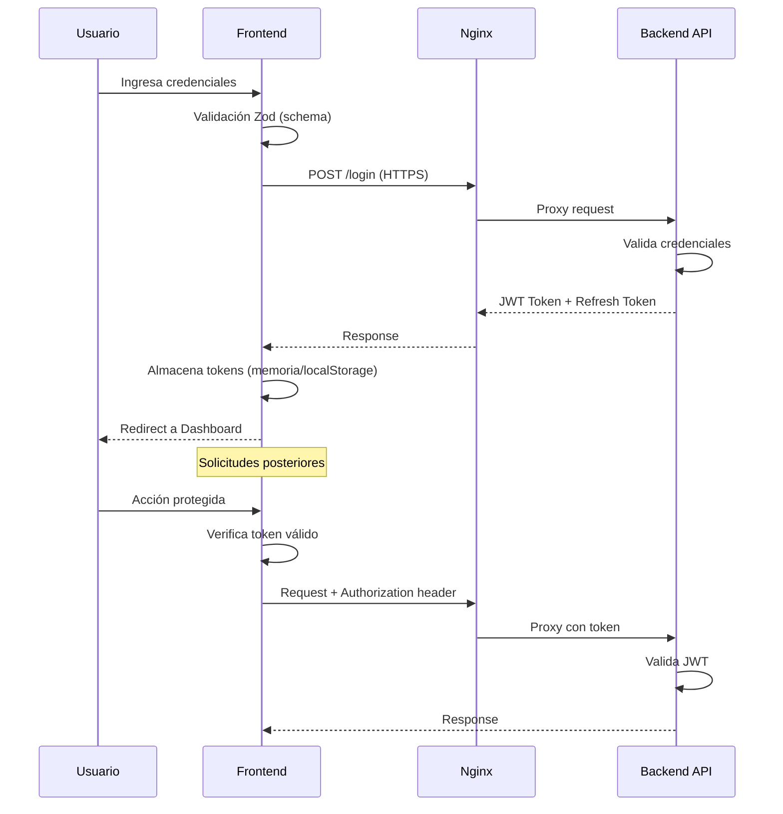

# 🏛️ Arquitectura de Seguridad - ENERLOVA Frontend

**Fecha**: 4 Diciembre 2025  
**Versión**: 1.0  
**Estado**: Activo

---

## 📋 Tabla de Contenidos

1. [Visión General](#visión-general)
2. [Capas de Seguridad](#capas-de-seguridad)
3. [Flujo de Autenticación](#flujo-de-autenticación)
4. [Protección de Datos](#protección-de-datos)
5. [Controles de Seguridad](#controles-de-seguridad)
6. [Dependencias de Seguridad](#dependencias-de-seguridad)

---

## 🎯 Visión General

ENERLOVA Frontend es una aplicación **React Router v7** que implementa un modelo de seguridad en capas, siguiendo las recomendaciones de **OWASP Top 10**.

### Stack Tecnológico

| Capa | Tecnología | Propósito de Seguridad |
|------|------------|------------------------|
| **Frontend** | React 19 + TypeScript | Type safety, escapado automático XSS |
| **Routing** | React Router v7 | Protección de rutas, guards |
| **Validación** | Zod | Validación de entrada, prevención de inyección |
| **HTTP Client** | Axios | Interceptores, manejo de tokens |
| **Forms** | React Hook Form | Validación cliente-side |
| **Server** | Nginx | Headers de seguridad, TLS |

---

## 🛡️ Capas de Seguridad

```
┌─────────────────────────────────────────────────────────────┐
│                       CLIENTE (Browser)                      │
│  ┌─────────────────────────────────────────────────────────┐ │
│  │  CSP │ CORS │ SameSite Cookies │ HTTPS Only            │ │
│  └─────────────────────────────────────────────────────────┘ │
└─────────────────────────────────────────────────────────────┘
                              │
                              ▼
┌─────────────────────────────────────────────────────────────┐
│                         NGINX                                │
│  ┌─────────────────────────────────────────────────────────┐ │
│  │  Security Headers │ TLS 1.2/1.3 │ Rate Limiting         │ │
│  └─────────────────────────────────────────────────────────┘ │
└─────────────────────────────────────────────────────────────┘
                              │
                              ▼
┌─────────────────────────────────────────────────────────────┐
│                    REACT APPLICATION                         │
│  ┌──────────────┐  ┌──────────────┐  ┌──────────────┐       │
│  │   Auth       │  │   Route      │  │   API        │       │
│  │   Context    │  │   Guards     │  │   Interceptors│      │
│  └──────────────┘  └──────────────┘  └──────────────┘       │
│  ┌──────────────┐  ┌──────────────┐  ┌──────────────┐       │
│  │   Zod        │  │   Form       │  │   Error      │       │
│  │   Validation │  │   Validation │  │   Boundaries │       │
│  └──────────────┘  └──────────────┘  └──────────────┘       │
└─────────────────────────────────────────────────────────────┘
                              │
                              ▼
┌─────────────────────────────────────────────────────────────┐
│                      BACKEND API                             │
│  (Fuera del alcance de este documento)                       │
└─────────────────────────────────────────────────────────────┘
```

---

## 🔐 Flujo de Autenticación

### Diagrama de Secuencia



### Almacenamiento de Tokens

| Token | Almacenamiento | Duración | Renovación |
|-------|----------------|----------|------------|
| **Access Token** | Memoria (Context) | 15-30 min | Automática |
| **Refresh Token** | localStorage* | 7 días | Manual |

> ⚠️ **Nota**: El uso de `localStorage` para refresh tokens es una conveniencia. Para máxima seguridad, considerar `httpOnly` cookies gestionadas por el backend.

---

## 🔒 Protección de Datos

### Datos Sensibles en Frontend

| Dato | Clasificación | Protección |
|------|---------------|------------|
| JWT Token | 🔴 Crítico | Memoria + expiración corta |
| Refresh Token | 🔴 Crítico | localStorage + renovación |
| Datos de usuario | 🟠 Sensible | No persistencia local |
| Preferencias UI | 🟢 Público | localStorage |

### Principios de Manejo

1. **Minimización**: Solo solicitar/almacenar datos necesarios
2. **Expiración**: Tokens con vida útil limitada
3. **Limpieza**: Borrar datos en logout
4. **No logging**: No registrar datos sensibles en consola

---

## 🛠️ Controles de Seguridad

### 1. Headers de Seguridad (Nginx)

```nginx
# Content Security Policy
add_header Content-Security-Policy "default-src 'self'; script-src 'self' 'unsafe-inline' 'unsafe-eval'; style-src 'self' 'unsafe-inline'; img-src 'self' data: https:; font-src 'self' data:; connect-src 'self' https://*; frame-ancestors 'none';" always;

# HSTS
add_header Strict-Transport-Security "max-age=31536000; includeSubDomains; preload" always;

# Otros headers
add_header X-Content-Type-Options "nosniff" always;
add_header X-Frame-Options "DENY" always;
add_header X-XSS-Protection "1; mode=block" always;
add_header Referrer-Policy "strict-origin-when-cross-origin" always;
add_header Permissions-Policy "geolocation=(), microphone=(), camera=()" always;
```

### 2. Validación con Zod

```typescript
// Ejemplo de schema de validación
const LoginSchema = z.object({
  usuario: z.string()
    .min(1, "Usuario requerido")
    .max(50, "Usuario muy largo"),
  contrasena: z.string()
    .min(8, "Mínimo 8 caracteres")
    .max(100, "Contraseña muy larga")
});
```

### 3. Protección de Rutas

```typescript
// Route Guard ejemplo
function ProtectedRoute({ children }: { children: React.ReactNode }) {
  const { user, isLoading } = useAuth();
  
  if (isLoading) return <LoadingSpinner />;
  if (!user) return <Navigate to="/login" />;
  
  return children;
}
```

### 4. Interceptores Axios

```typescript
// Request interceptor - agrega token
axiosInstance.interceptors.request.use((config) => {
  const token = getAccessToken();
  if (token) {
    config.headers.Authorization = `Bearer ${token}`;
  }
  return config;
});

// Response interceptor - maneja 401
axiosInstance.interceptors.response.use(
  (response) => response,
  async (error) => {
    if (error.response?.status === 401) {
      // Intentar refresh o redirect a login
    }
    return Promise.reject(error);
  }
);
```

---

## 📦 Dependencias de Seguridad

### Análisis de Seguridad Implementado

| Herramienta | Tipo | Frecuencia | Ubicación |
|-------------|------|------------|-----------|
| **Dependabot** | SCA | Semanal | GitHub |
| **npm audit** | SCA | Cada build | CI/CD |
| **SonarQube** | SAST | Cada PR | CI/CD |
| **OWASP ZAP** | DAST | PRs + Semanal | CI/CD |
| **ESLint** | SAST | Cada build | CI/CD |
| **TypeScript** | SAST | Cada build | CI/CD |

### Dependencias Críticas de Seguridad

| Dependencia | Versión | Propósito |
|-------------|---------|-----------|
| `zod` | ^3.25 | Validación de esquemas |
| `axios` | ^1.13 | HTTP client con interceptores |
| `jwt-decode` | ^4.0 | Decodificación de tokens |

---

## 📊 Métricas de Seguridad

### KPIs a Monitorear

| Métrica | Objetivo | Frecuencia |
|---------|----------|------------|
| Vulnerabilidades críticas | 0 | Continuo |
| Vulnerabilidades altas | < 3 | Semanal |
| Tiempo de parcheo (crítico) | < 24h | Por evento |
| Cobertura de código | > 70% | Por PR |
| Quality Gate SonarQube | Pass | Por PR |

---

## 📝 Changelog

| Versión | Fecha | Cambios |
|---------|-------|---------|
| 1.0 | 04-12-2025 | Documento inicial |

---

**Documento mantenido por**: [@gbourguett](https://github.com/gbourguett)  
**Próxima revisión**: 04-01-2026
